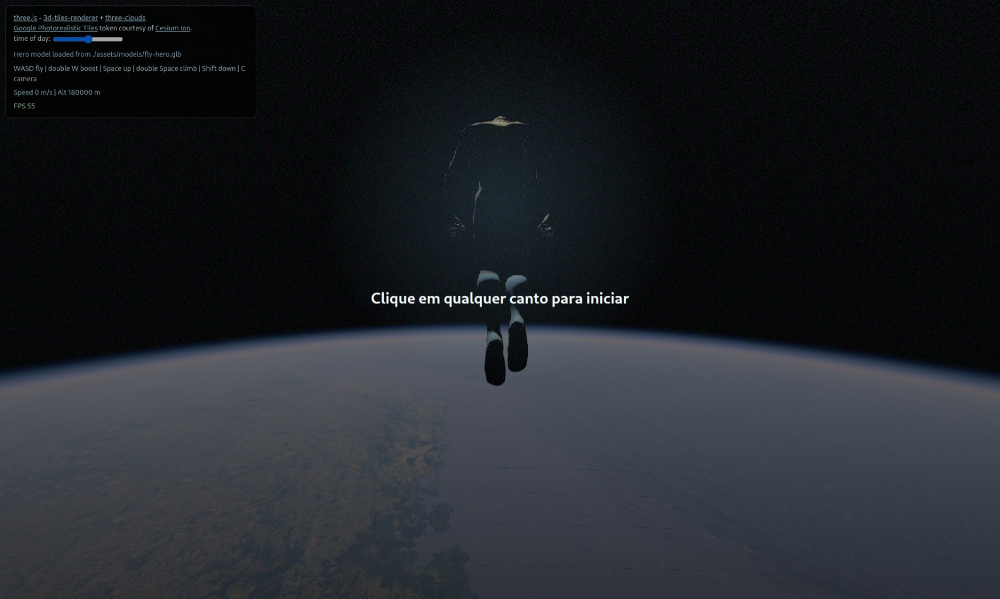
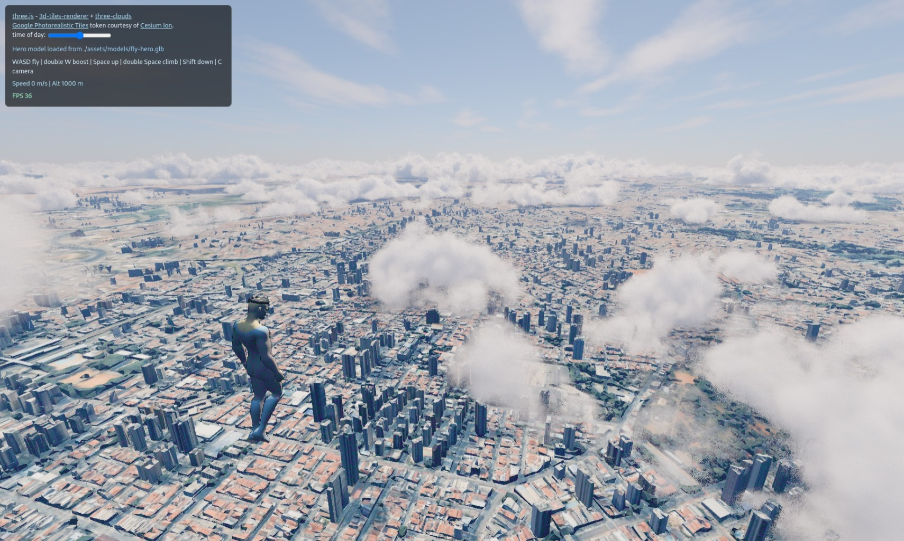

# Invencivel voando sobre Sao Paulo

Demo standalone em `three.js` com Google Photorealistic 3D Tiles via Cesium Ion, nuvens, atmosfera, audio de vento, passarinhos ocasionais e um heroi voavel com teclado e mouse.





## Como rodar

Sirva a pasta com um servidor local. Abrir direto pelo arquivo pode quebrar modulos ES, modelos GLB e audio.

```bash
python3 -m http.server 8001
```

Depois abra:

```text
http://127.0.0.1:8001/index.html
```

## Controles

- `Clique em qualquer canto`: inicia a intro.
- `W`: voa para frente.
- `W` duas vezes: boost supersonico para frente.
- `S`: freia ou volta.
- `A` e `D`: vira com inclinacao.
- `Space`: sobe.
- `Space` duas vezes: subida supersonica.
- `Shift`: desce ate 100 metros.
- `Mouse`: move a camera ao redor do heroi.
- `C`: alterna entre camera seguindo o heroi e controle livre do globo.

## Estrutura

```text
.
+-- assets/
|   +-- audio/
|   |   +-- vento.wav
|   +-- models/
|   |   +-- Flamingo.glb
|   |   +-- Parrot.glb
|   |   +-- Stork.glb
|   |   +-- fly-hero.glb
|   +-- screenshots/
|       +-- flight-sao-paulo.jpeg
|       +-- intro-space.jpeg
+-- index.html
+-- tests/
    +-- flight-controls.test.mjs
```

## Assets

O demo espera estes arquivos locais:

- `assets/models/fly-hero.glb`: modelo principal do heroi.
- `assets/models/Flamingo.glb`, `assets/models/Stork.glb`, `assets/models/Parrot.glb`: passaros ocasionais.
- `assets/audio/vento.wav`: loop de vento iniciado apos a primeira interacao.
- `assets/screenshots/*.jpeg`: imagens usadas neste README.

## Cesium Ion

O `index.html` usa `CesiumIonAuthPlugin` com o asset `2275207`, o mesmo caminho do exemplo de 3D tiles do `three.js`. Para desenvolvimento real, substitua `ION_KEY` por um token pessoal do Cesium Ion.

## Teste rapido

```bash
node tests/flight-controls.test.mjs
```

Para checar a sintaxe do modulo dentro do HTML:

```bash
awk 'BEGIN{p=0} /<script type="module">/{p=1; next} /<\/script>/{if(p){exit}} p{print}' index.html > /tmp/teste-three-index-module.mjs
node --check /tmp/teste-three-index-module.mjs
```

## Notas

`ConnectionResetError` no `python3 -m http.server` normalmente significa que o navegador cancelou uma requisicao no meio, geralmente por cache, reload ou audio. `404` para `favicon.ico` e `.well-known/appspecific/com.chrome.devtools.json` tambem nao afetam o demo.
